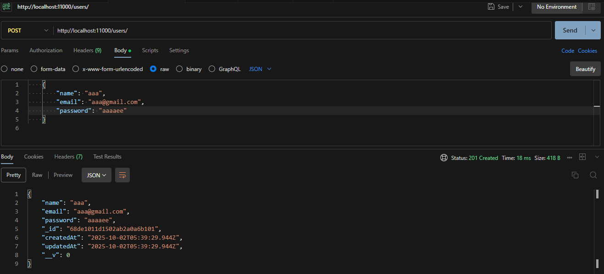

# Lab: Implement a Working Express Server and a User Model with Mongoose

This lab walks you through setting up an Express server and connecting it to MongoDB using Mongoose. By the end, you’ll have a functional backend that can handle user data.

---

## Purpose

This is a **hands-on lab** designed to simulate real development work:
- Debug issues
- Troubleshoot errors
- Solve problems independently

Note: Even small typos (like a missing comma or wrong filename) can break the server. Double-check everything!

---

## 1. Install Requirements

### Node.js
- Download & install from [nodejs.org](https://nodejs.org/en).
- Verify install:
  ```bash
  node --version
  npm --version
  ```

### VS Code
- Download & install [Visual Studio Code](https://code.visualstudio.com/).

---

## 2. Project Setup

1. Create a folder for your project, e.g. `C:\mongoproj`.
2. Open terminal inside it and run:
   ```bash
   npm init -y
   ```
   This generates a `package.json`.

---

## 3. Install Dependencies

### Express & dotenv
```bash
npm install express dotenv
```

### Nodemon (for development)
```bash
npm install -D nodemon
```

Update `package.json` scripts:

```json
"scripts": {
  "start": "NODE_ENV=production node server.js",
  "dev": "nodemon server.js"
}
```

---

## 4. Create `server.js`

```js
const path = require('path');
const express = require('express');
const app = express();
require('dotenv').config({ path: path.join(__dirname, 'config', 'config.env') });

app.use(express.json());

// Test route
app.get('/', (req, res) => {
  res.send('Hello from express');
});

// Start server
const PORT = process.env.PORT || 11000;
app.listen(PORT, () => {
  console.log(`Express server listening on port ${PORT}`);
});
```

---

## 5. Create `config/config.env`

```env
PORT=11000
MONGO_URI=mongodb://localhost:27017/mongoproj
```

---

## 6. Run the Server

```bash
npm run dev
```

Open: [http://localhost:11000](http://localhost:11000)  
✅ You should see: **Hello from express**

---

## 7. Troubleshooting

- Make sure server is running (`npm run dev`)
- Verify no typos in `server.js`, `package.json`, `config.env`
- Correct port = **11000**
- If still failing: reinstall Node.js and VS Code

---

## 8. Install & Configure Mongoose

Install:
```bash
npm install mongoose
```

Create `config/db.js`:

```js
const mongoose = require('mongoose');

const connectDB = async () => {
  try {
    await mongoose.connect(process.env.MONGO_URI);
    console.log('MongoDB connected');
  } catch (err) {
    console.error(err.message);
    process.exit(1);
  }
};

module.exports = connectDB;
```

Update `server.js` to call `connectDB()`:

```js
const connectDB = require('./config/db');
connectDB();
```

Run again:
```bash
npm run dev
```
✅ You should see **MongoDB connected**

---

## 9. Create User Model

`models/User.js`:
```js
const { Schema, model } = require('mongoose');

const userSchema = new Schema({
  name: { type: String, required: true },
  email: { type: String, required: true, unique: true },
  password: { type: String, required: true }
}, { timestamps: true });

module.exports = model('User', userSchema);
```

---

## 10. CRUD Operations

Add to `server.js` (before `app.listen`):

```js
const User = require('./models/User');

// CREATE
app.post('/users', async (req, res) => {
  try {
    const user = await User.create(req.body);
    res.status(201).json(user);
  } catch (err) {
    res.status(400).json({ error: err.message });
  }
});

// READ
app.get('/users', async (req, res) => {
  try {
    const users = await User.find(req.query || {});
    res.json(users);
  } catch (err) {
    res.status(500).json({ error: err.message });
  }
});

// UPDATE
app.patch('/users/:id', async (req, res) => {
  try {
    const updated = await User.findByIdAndUpdate(req.params.id, req.body, { new: true, runValidators: true });
    res.json(updated);
  } catch (err) {
    res.status(400).json({ error: err.message });
  }
});

// DELETE
app.delete('/users', async (req, res) => {
  try {
    const result = await User.deleteMany(req.query || {});
    res.json(result);
  } catch (err) {
    res.status(500).json({ error: err.message });
  }
});
```

---

## 11. Test the API

Using **curl**:

- Create:
  ```bash
  curl -X POST http://localhost:11000/users     -H "Content-Type: application/json"     -d '{"name":"Alice","email":"alice@example.com","password":"secret"}'
  ```
- Read:
  ```bash
  curl http://localhost:11000/users
  ```
- Update:
  ```bash
  curl -X PATCH http://localhost:11000/users/<id>     -H "Content-Type: application/json"     -d '{"name":"Alice Updated"}'
  ```
- Delete:
  ```bash
  curl -X DELETE "http://localhost:11000/users?name=Alice%20Updated"
  ```


## 12. Test API with postman

Using Postman in IDE to test.

a. POST




b. GET


3. PATCH


d. DELETE


## Summary 

- Express server running  
- MongoDB connected  
- User model created  
- Full CRUD routes working  

Next steps:
- Add validation
- Hash passwords
- Organize routes/controllers
- Connect to a frontend app
